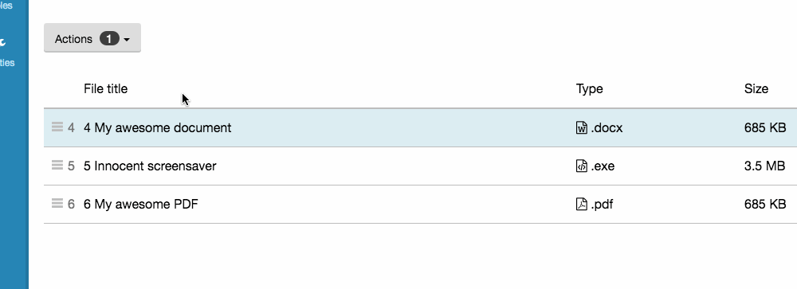

## Basic structure

Because of the sheer amount of markup that tables can contain, tables are one of the only components where the styling is applied largely to element selectors. You do, however, need the `table` class on the `<table>` element.

```html
<table class="table">
    <thead>
        <tr>
            <th>Column 1</th>
            <th>Column 2</th>
        </tr>
    </thead>
    <tbody>
        <tr>
            <td>Cell 1</td>
            <td>Cell 2</td>
        </tr>
    </tbody>
</table>
```

## State classes

Table rows will accept the normal collection of state classes which will highlight the entire row. These classes should be applied to the `<tr>` element.

* has-success
* has-warning
* has-danger
* has-info
* has-inverse
* has-new

## Tables with badges in "Actions" dropdown

To add badges to the "Actions" dropdown when items are selected a class "has-badges" needs to be added in an element (div or form) grouping both the dropdown and the table together.



```html
<div class="has-badges">
	<button data-toggle="dropdown" class="btn dropdown__toggle">Actions&nbsp;<span class="caret"></span></button>
	...
	<table class="table">
	    <thead>
	        <tr>
	            <th>Column 1</th>
	            <th>Column 2</th>
	        </tr>
	    </thead>
	    <tbody>
	        <tr>
	            <td>Cell 1</td>
	            <td>Cell 2</td>
	        </tr>
	    </tbody>
	</table>
</div>
```

## Accessibility

### Empty th cells

Empty `<th></th>` tags will trigger a warning in the [WAVE tool](http://www.wave.webaim.org).

If you need an empty cell within the `<thead>`, use a `<td>` instead of a `<th>`, it's perfectly valid and won't throw an accessibility error.

###### Example

```html
<table class="table">
    <thead>
        <tr>
            <td></td>
            <th>Column 2</th>
        </tr>
    </thead>
    ...
```

