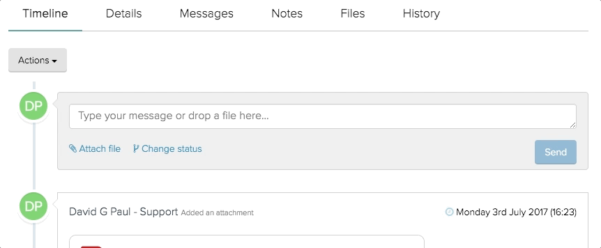

import Tabs from '@theme/Tabs';
import TabItem from '@theme/TabItem';

The DropZone is a component that can create a pre-formatted area for users to drag files, it can also be used to convert an existing HTML element into a droppable area.

## Example usage

### Default configuration

<div className="d-example">
  <div id="drop-zone" className="dropzone dropzone--idle dropzone--files-5">
    <div className="dropzone__state"></div>
    <div className="dropzone__icon-wrapper">
      <i aria-hidden="true" className="icon-file-pdf-o dropzone__icon dropzone__icon--small dropzone__icon--left"></i>
      <i aria-hidden="true" className="icon-file-image-o dropzone__icon dropzone__icon--small dropzone__icon--centre"></i>
      <i aria-hidden="true" className="icon-file-text-o dropzone__icon dropzone__icon--small dropzone__icon--right"></i>
      <i aria-hidden="true" className="icon-cloud-upload dropzone__icon dropzone__icon--main"></i>
    </div>
    <p className="dropzone__label">Drag &amp; Drop</p>
    <p className="dropzone__info">your files here or <a className="dropzone__browse" id="#">Browse Files</a></p>
    <p className="dropzone__help"
      data-toggle="popover"
      data-autoclose="true"
      data-title="Helper title"
      data-content="Helper content"
      data-html="true"
      data-placement="bottom"
      data-container="#drop-zone"
    >
      <i aria-hidden="true" className="icon-question-sign"></i> Only certain file types are allowed
    </p>
  </div>
</div>

<Tabs
  groupID="example"
  defaultValue="twig"
  values={[
    { label: 'Twig', value: 'twig', },
    { label: 'HTML', value: 'html', },
    { label: 'JS (required)', value: 'js', }
  ]
}>
<TabItem value="twig">

```twig
{{
  html.dropzone({
    'id': 'drop-zone'
  })
}}
```

</TabItem>
<TabItem value="html">

```html
<div id="drop-zone" class="dropzone dropzone--idle dropzone--files-5">
  <div class="dropzone__state"></div>
  <div class="dropzone__icon-wrapper">
    <i aria-hidden="true" class="icon-file-pdf-o dropzone__icon dropzone__icon--small dropzone__icon--left"></i>
    <i aria-hidden="true" class="icon-file-image-o dropzone__icon dropzone__icon--small dropzone__icon--centre"></i>
    <i aria-hidden="true" class="icon-file-text-o dropzone__icon dropzone__icon--small dropzone__icon--right"></i>
    <i aria-hidden="true" class="icon-cloud-upload dropzone__icon dropzone__icon--main"></i>
  </div>
  <p class="dropzone__label">Drag &amp; Drop</p>
  <p class="dropzone__info">your files here or <a class="dropzone__browse" id="#">Browse Files</a></p>
  <p class="dropzone__help"
     data-toggle="popover"
     data-autoclose="true"
     data-title="Helper title"
     data-content="Helper content"
     data-html="true"
     data-placement="bottom"
     data-container="#drop-zone"
  >
    <i aria-hidden="true" class="icon-question-sign"></i> Only certain file types are allowed
  </p>
</div>
```

</TabItem>
<TabItem value="js">

```jsx
import DropZoneComponentFactory from '../path/to/DropZoneComponentFactory';

const dropZoneComponent = DropZoneComponentFactory.create(
    // &lt;html&gt; element
    document.documentElement,
    // selector to identify DropZone elements
    '.dropzone'
);

dropZoneComponent.init();
```

</TabItem>
</Tabs>

## Passive

When in passive mode, the DropZoneComponent will not alter any HTML apart from adding file nodes once a file is added. It should be used for when you need to turn an existing element into a DropZone and do not want to use the default DropZone HTML. When in passive mode you will need to leverage the DropZoneComponent public methods (below) in order to change state.

<div className="d-example">
  <div className="dropzone" data-dropzone-passive="true">
    <p>Node to be converted to a DropZone</p>
  </div>
</div>

<Tabs
  groupID="example"
  defaultValue="html"
  values={[
    { label: 'HTML', value: 'html', }
  ]
}>
<TabItem value="html">

```html
<div class="dropzone" data-dropzone-passive="true">
    <p>Node to be converted to a DropZone</p>
</div>
```

</TabItem>
</Tabs>

### Enriched passive

An example of a passive DropZone leveraging the DropZoneComponent's callbacks and public methods (see below) to trigger help state changes and a backdrop.



### Submission

In order to use a DropZone as a file input for a form, it is required that the form is submitted as a XHR / Ajax request. This is necessary as we need to be able to query the DropZoneComponent API to retrieve files before sending the form.

```jsx
const data = new FormData(form);
const id = parseInt(dropZoneHtmlNode.getAttribute('data-dropzone-id'));
const file = dropZoneComponent.getFilesFromDropZone(id, 0);

data.append('dropzone-file', file.raw);

// ...
```

When retrieving files from a DropZone instance, you should expect the following schema.

```json
{
  id: [Number], // a unique identifier
  raw: [FileObject], // a reference to the original FileObject
  name: [String], // file name
  type: [String], // file type
  size: [String], // file size
  thumbnail: [String|false], // file thumbnail
  meta: [Object] // additional file information
}
```

## Options

Options can be initialised as part of the `init({...options})` method, or as attributes on DropZone HTML elements. Below are a list of configurable options with an environment table showing initiation examples.

Any option from the reference above that is prefixed with `data-dropzone-` can be initialised using the twig helper (or HTML when in passive mode) or through the DropZone’s `init(...)` method as a camel case version of the attribute.

### Max files

The max files option sets the maximum amount of files allowed onto the DropZone, this is a running total and will persist across multiple drops. If the limit is exceeded a DropZone error will be thrown.

| Environment | Code |
| ----------- | ---- |
| Twig | `html.dropzone({ 'data-dropzone-max-files': '5' })` |
| HTML | `<div data-dropzone-max-files="5"></div>` |
| Javascript | `dropZoneComponent.init({ maxfiles: 5 })` |

### Max size

```jsx
@param {String|Number}
@default [3e+8]
```

The max size option sets the maximum amount of bytes allowed on the DropZone, this is a running total and will persist across multiple drops. If the limit is exceeded a DropZone error will be thrown.

| Environment | Code |
| ----------- | ---- |
| Twig | `html.dropzone({ 'data-dropzone-max-size': '50000' })` |
| HTML | `<div data-dropzone-max-size="50000"></div>` |
| Javascript | `dropZoneComponent.init({ maxSize: 50000 })` |

### Idle HTML

```jsx
@param {String}
@default ['your files here or Browse Files']
```

The idle HTML option specifies the HTML content for the DropZone helper node when it is in it's idle state.

| Environment | Code |
| ----------- | ---- |
| Twig | `html.dropzone({ 'data-dropzone-idle-html': '<p>foo</p>' })` |
| HTML | `<div data-dropzone-idle-html="<p>foo</p>"></div>` |
| Javascript | `dropZoneComponent.init({ idleHtml: '<p>foo</p>' })` |

### Window enter HTML

```
@param {String}
@default ['Drag your files here']
```

The window enter HTML option specifies the HTML content for the DropZone helper node when files have entered the window.

| Environment | Code |
| ----------- | ---- |
| Twig | `html.dropzone({ 'data-dropzone-window-enter-html': '<p>foo</p>' })` |
| HTML | `<div data-dropzone-window-enter-html="<p>foo</p>"></div>` |
| Javascript | `dropZoneComponent.init({ windowEnterHtml: '<p>foo</p>' })` |

### DropZone enter HTML

@param {String}
@default ['Drop your files here']
The DropZone enter HTML option specifies the HTML content for the DropZone helper node when files have entered the DropZone.

| Environment | Code |
| ----------- | ---- |
| Twig | `html.dropzone({ 'data-dropzone-drop-zone-enter-html': '<p>foo</p>' })` |
| HTML | `<div data-dropzone-drop-zone-enter-html="<p>foo</p>"></div>` |
| Javascript | `dropZoneComponent.init({ dropZoneEnterHtml: '<p>foo</p>' })` |

### Passive

```jsx
@param {Boolean}
@default [false]
```

The passive option specifies if the DropZone will be in passive mode.

| Environment | Code |
| ----------- | ---- |
| Twig | `html.dropzone({ 'data-dropzone-passive': true })` |
| HTML | `<div data-dropzone-passive="true"></div>` |
| Javascript | `dropZoneComponent.init({ passive: true })` |

### Supported

```jsx
@param {Boolean}
@default [true]
```

The supported option specifies whether the plugin attaches events to the environment. This will typically be used in environments that do not support the File API, IE9 for instance. Therefore it makes most sense to set this options in the JavaScript init code as we'll be able to determine the environment at that point.

| Environment | Code |
| ----------- | ---- |
| Twig | `html.dropzone({ 'data-dropzone-supported': false })` |
| HTML | `<div data-dropzone-input-supported="false"></div>` |
| Javascript | `dropZoneComponent.init({ supported: document.documentElement.search('lt-ie10') < 0 })` |

### Input node ID

```jsx
@param {String|null}
@default [null]
```

The input node ID option specifies whether there is a corresponding input node, the value should be the ID attribute on said node. This is useful if you need to hook the DropZone up to an already existing input node, it also allows us to use the native "Browse" functionality.

| Environment | Code |
| ----------- | ---- |
| Twig | `html.dropzone({ 'data-dropzone-input-node-id': 'foo' })` |
| HTML | `<div data-dropzone-input-node-id="foo"></div>` |
| Javascript | `dropZoneComponent.init({ inputNodeId: 'foo' })` |

### Show input node

```jsx
@param {Boolean}
@default [false]
```

The show input node option specifies if the corresponding input node should be hidden by the DropZoneComponent. It's recommended that this is handled in CSS to prevent any flashing of the input element.

| Environment | Code |
| ----------- | ---- |
| Twig | `html.dropzone({ 'data-dropzone-show-input-node': 'true' })` |
| HTML | `<div data-dropzone-show-input-node="true"></div>` |
| Javascript | `dropZoneComponent.init({ showInputNodeId: true })` |

### File node description

```jsx
@param {Boolean}
@default [true]
```

The file node description option specifies if the file HTML that is generated includes the file description.

| Environment | Code |
| ----------- | ---- |
| Twig | `html.dropzone({ 'data-dropzone-file-node-desc': 'false' })` |
| HTML | `<div data-dropzone-file-node-desc="false"></div>` |
| Javascript | `dropZoneComponent.init({ fileNodeDesc: false })` |

### File node name

```jsx
@param {Boolean}
@default [true]
```

The file node name option specifies if the file HTML that is generated includes the file name.

| Environment | Code |
| ----------- | ---- |
| Twig | `html.dropzone({ 'data-dropzone-file-node-name': 'false' })` |
| HTML | `<div data-dropzone-file-node-name="false"></div>` |
| Javascript | `dropZoneComponent.init({ fileNodeName: false })` |

### File node size

```jsx
@param {Boolean}
@default [true]
```

The file node size option specifies if the file HTML that is generated includes the file size.

| Environment | Code |
| ----------- | ---- |
| Twig | `html.dropzone({ 'data-dropzone-file-node-size': 'false' })` |
| HTML | `<div data-dropzone-file-node-size="false"></div>` |
| Javascript | `dropZoneComponent.init({ fileNodeSize: false })` |

### File node type

```jsx
@param {Boolean}
@default [true]
```

The file node type option specifies if the file HTML that is generated includes the file type.

| Environment | Code |
| ----------- | ---- |
| Twig | `html.dropzone({ 'data-dropzone-file-node-type': 'false' })` |
| HTML | `<div data-dropzone-file-node-type="false"></div>` |
| Javascript | `dropZoneComponent.init({ fileNodeType: false })` |

## Callbacks

There are several callbacks at your disposal when it comes to interacting with the DropZone API. These will come in handy when the DropZone is in 'passive' mode. Each callback is fired and passed an object containing contextual information.

### Window enter

The window enter callback is triggered once files have been dragged onto the browser window.

```jsx
dropZoneComponent.init({
  /**
   * @param {Boolean} valid | Determine if the files are valid
   * @param {String} text | If the files are not valid this is the validation message
   * @param {DropZoneComponent} instance | A reference to the DropZoneComponent
   */
  customWindowEnter: ({ valid, text, instance }) => 'Window entered!'
});
```

### Window leave

The window leave callback is triggered once files have been dragged off of the window.

```jsx
dropZoneComponent.init({
  /**
   * @param {DropZoneComponent} instance | A reference to the DropZoneComponent
   */
  customWindowLeave: ({ instance }) => 'Window exited!'
});
```

### Window drop

The window drop callback is triggered once files have been dropped onto window, but not the DropZone.

```jsx
dropZoneComponent.init({
  /**
   * @param {Array} files | A collection of file objects
   * @param {DropZoneComponent} instance | A reference to the DropZoneComponent
   */
  customWindowDrop: ({ files, instance }) => 'Window drop!'
});
```

### DropZone enter

The DropZone enter callback is triggered once files have been dragged onto the DropZone element.

```jsx
dropZoneComponent.init({
  /**
   * @param {Boolean} valid | Determine if the files are valid
   * @param {String} text | If the files are not valid this is the validation message
   * @param {DropZoneComponent} instance | A reference to the DropZoneComponent
   */
  customDropZoneEnter: ({ valid, text, instance }) => 'DropZone entered!'
});
```

### DropZone leave

The DropZone leave callback is triggered once files have been dragged off of the DropZone element.

```jsx
dropZoneComponent.init({
  /**
   * @param {Boolean} valid | Determine if the files are valid
   * @param {String} text | If the files are not valid this is the validation message
   * @param {DropZoneComponent} instance | A reference to the DropZoneComponent
   */
  customDropZoneEnter: ({ valid, text, instance }) => 'DropZone exited!'
});
```

### DropZone drop

The DropZone drop callback is triggered once files have been dropped onto the DropZone element.

```jsx
dropZoneComponent.init({
  /**
   * @param {Boolean} valid | Determine if the files are valid
   * @param {String} text | If the files are not valid this is the validation message
   * @param {Array} files | A collection of file objects
   * @param {DropZoneComponent} instance | A reference to the DropZoneComponent
   */
  customDropZoneDrop: ({ files, valid, text, instance }) => 'DropZone drop!'
});
```

### File removed

The file removed callback is triggered once a file has been removed from the DropZone.

```jsx
dropZoneComponent.init({
  /**
   * @param {DropZoneComponent} instance | A reference to the DropZoneComponent
   */
  customFileRemoved: ({ instance }) => 'File removed!'
});
```

## Public methods

There are a few public methods at your disposal when integrating a DropZone which are intended to make creating custom instances as flexible as they can be. Most public methods will take the DropZoneId as an argument, this is an integer representing the DropZoneComponent instance. It will be added to DropZoneComponents once they have been initialised in both passive and non-passive modes.

### Validate files

The `validateFiles` method will pass files through the DropZoneComponent validator.

```jsx
const id = parseInt(dropZoneHtmlNode.getAttribute('data-dropzone-id'));

/**
 * @param {FileList} files | file(s) to pass through the validator
 * @param {number} id | DropZoneComponent ID
 * @returns {{ valid: Boolean, text: String }} validation object
 */
dropZoneComponent.validateFiles(files, id);
```

### Add files to DropZone

The `addFilesToDropZone` method will add a collection of files to a DropZone instance.

```jsx
const id = parseInt(dropZoneHtmlNode.getAttribute('data-dropzone-id'));

/**
 * @param {FileList} files | file(s) to add to the instance
 * @param {number} id | DropZoneComponent ID
 * @param {Object} meta | an optional object of data to add to the file object
 */
dropZoneComponent.addFilesToDropZone(files, id, { description: 'my file' });
```

### Reset DropZone instance

The `reset` method can reset all (or specified) DropZone instances. This method will remove any files currently attached to the DropZone and reset the info HTML state.

```jsx
const id = parseInt(dropZoneHtmlNode.getAttribute('data-dropzone-id'));

/**
 * @param {number} id | optional DropZoneComponent ID
 */
dropZoneComponent.reset();
```

### Get files from DropZone instance

The `getFilesFromDropZone` will return all files attached to an instance. Files will be passed back through the validator to catch edge cases where files are removed after being added onto the DropZone.

```jsx
const id = parseInt(dropZoneHtmlNode.getAttribute('data-dropzone-id'));

/**
 * @param {number} id | DropZoneComponent ID
 * @param {number} index | an optional index referencing a single file
 * @returns {{ valid: Boolean, text: String, files: Array }}
 */
dropZoneComponent.getFilesFromDropZone(id);
```

### Get DropZone instance idleHtml

The `getInstanceIdleHtml` method retrieves the idleHtml option on a specified instance.

```jsx
const id = parseInt(dropZoneHtmlNode.getAttribute('data-dropzone-id'));

/**
 * @param {number} id | DropZoneComponent ID
 * @returns {String} idleHtml
 */
dropZoneComponent.getInstanceIdleHtml(id);
```

### Get DropZone instance windowEnterHtml

The `getInstanceWindowEnterHtml` method retrieves the windowEnterHtml option on a specified instance.

```jsx
const id = parseInt(dropZoneHtmlNode.getAttribute('data-dropzone-id'));

/**
 * @param {number} id | DropZoneComponent ID
 * @returns {String} windowEnterHtml
 */
dropZoneComponent.getInstanceWindowEnterHtml(id);
```

### Get DropZone instance dropZoneEnterHtml

The `getInstanceDropZoneEnterHtml` method retrieves the dropZoneEnterHtml option on a specified instance.

```jsx
const id = parseInt(dropZoneHtmlNode.getAttribute('data-dropzone-id'));

/**
 * @param {number} id | DropZoneComponent ID
 * @returns {String} dropZoneEnterHtml
 */
dropZoneComponent.getInstanceDropZoneEnterHtml(id);
```

### Get DropZone instance supportsDataTransferItems

The `getSupportsDataTransferItems` method retrieves the supportsDataTransferItems option on a specified instance.

```jsx
const id = parseInt(dropZoneHtmlNode.getAttribute('data-dropzone-id'));

/**
 * @param {number} id | DropZoneComponent ID
 * @returns {Boolean} data transfer support
 */
dropZoneComponent.getSupportsDataTransferItems(id);
```