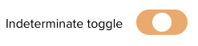

import Tabs from '@theme/Tabs';
import TabItem from '@theme/TabItem';

An alternative presentation for a checkbox, providing a more obvious visual indication of the on/off state.

<div className="d-example">
  <div className="form__group form__group--toggle">
    <label className="toggle-switch-wrapper-label" htmlFor="guid-1181820001">
      <span className="control__label">Turn me on?</span>
      <span className="controls">
        <input id="guid-1181820001" name="toggle" type="checkbox" className="form__control toggle-switch" />
        <span className="toggle-switch-label"></span>
      </span>
    </label>
  </div>
</div>

## Basic usage

<Tabs
  groupID="example"
  defaultValue="twig"
  values={[
    { label: 'Twig', value: 'twig', },
    { label: 'HTML', value: 'html', },
  ]
}>
<TabItem value="twig">

```twig
{{
  form.toggle_switch({
    'label': 'Turn me on?',
    'id': 'guid-' ~ random(),
    'name': 'toggle'
  })
}}
```

</TabItem>
<TabItem value="html">

```html
<div class="form__group form__group--toggle">
  <label class="toggle-switch-wrapper-label" for="guid-1181820001">
    <span class="control__label">Turn me on?</span>
    <span class="controls">
      <input id="guid-1181820001" name="toggle" type="checkbox" class="form__control toggle-switch" />
      <span class="toggle-switch-label"></span>
    </span>
  </label>
</div>
```

</TabItem>
</Tabs>

## Helper options

You can configure this helper using the common helper options. The following options are specific to this helper.

| Option | Type | Description |
| ------ | ---- | ----------- |
| checked | boolean | Whether the input should be checked |
| indeterminate | boolean | Neither on nor off, shows the toggle in the middle of the options |

## States

### Checked

<div className="d-example">
  <div className="form__group form__group--toggle">
    <label className="toggle-switch-wrapper-label" htmlFor="guid-69562041">
      <span className="control__label">Checked toggle</span>
      <span className="controls">
        <input defaultChecked id="guid-69562041" name="toggle-checked" type="checkbox" className="form__control toggle-switch" />
        <span className="toggle-switch-label"></span>
      </span>
    </label>
  </div>
</div>

<Tabs
  groupID="example"
  defaultValue="twig"
  values={[
    { label: 'Twig', value: 'twig', },
    { label: 'HTML', value: 'html', },
  ]
}>
<TabItem value="twig">

```twig {4}
{{
  form.toggle_switch({
    'label': 'Checked toggle',
    'checked': true,
    'id': 'guid-' ~ random(),
    'name': 'toggle-checked'
  })
}}
```

</TabItem>
<TabItem value="html">

```html
<div class="form__group form__group--toggle">
  <label class="toggle-switch-wrapper-label" for="guid-69562041">
    <span class="control__label">Checked toggle</span>
    <span class="controls">
      <input checked id="guid-69562041" name="toggle-checked" type="checkbox" class="form__control toggle-switch" />
      <span class="toggle-switch-label"></span>
    </span>
  </label>
</div>
```

</TabItem>
</Tabs>

### Indeterminate

:::info
The indeterminate state can only be set via JavaScript. If you're using toggles in your own components, we'll presume you’re going to manage this.
:::



<Tabs
  groupID="example"
  defaultValue="twig"
  values={[
    { label: 'Twig', value: 'twig', },
    { label: 'HTML', value: 'html', },
  ]
}>
<TabItem value="twig">

```twig
{{
  form.toggle_switch({
    'label': 'Indeterminate toggle',
    'id': 'toggle-indeterminate',
    'name': 'toggle-indeterminate'
  })
}}
<!-- example javascript -->
<script type="text/javascript">
  var toggle = document.getElementById("toggle-indeterminate");
  toggle.indeterminate = true;
</script>
```

</TabItem>
<TabItem value="html">

```html
<div class="form__group form__group--toggle">
  <label class="toggle-switch-wrapper-label" for="toggle-indeterminate">
    <span class="control__label">Indeterminate toggle</span>
    <span class="controls">
      <input id="toggle-indeterminate" name="toggle-indeterminate" type="checkbox" class="form__control toggle-switch" />
      <span class="toggle-switch-label"></span>
    </span>
  </label>
</div>
<!-- example javascript -->
<script type="text/javascript">
  var toggle = document.getElementById("toggle-indeterminate");
  toggle.indeterminate = true;
</script>
```

</TabItem>
</Tabs>

## Best practices

Toggle switches should:

* Be a standalone choice, not grouped together (Use checkboxes or radios instead)
* Clearly indicate the implications of enabling or disabling the setting (e.g. “Disabling this integration will prevent you from taking payments.”)
* Inform the user why a toggle switch is disabled. Provide clear steps explaining how to enable the functionality

## Content guidelines

### Label

Toggle switch labels should:

* Use active voice/verbs where possible (e.g. Enable, Activate)
* Use as few words as possible to convey their intent

<div className="d-guidelines">
  <div className="d-guidelines__block d-guidelines__block--do">
  <div className="d-guidelines-preview">
    <div className="form__group form__group--toggle">
      <label className="toggle-switch-wrapper-label" htmlFor="guid-1105218033">
        <span className="control__label">Enable integration</span>
        <span className="controls">
          <input id="guid-1105218033" name="toggle-a1" type="checkbox" className="form__control toggle-switch" />
          <span className="toggle-switch-label"></span>
        </span>
      </label>
    </div>
    <div className="form__group form__group--toggle">
      <label className="toggle-switch-wrapper-label" htmlFor="guid-13936864">
        <span className="control__label">Enable integration</span>
        <span className="controls">
          <input id="guid-13936864" name="toggle-a2" defaultChecked type="checkbox" className="form__control toggle-switch" />
          <span className="toggle-switch-label"></span>
        </span>
      </label>
    </div>
  </div>
  <div className="d-guidelines-label"><em className="d-guidelines-label__title">Do</em> keep the label consistent, to indicate state</div></div>
  <div className="d-guidelines__block d-guidelines__block--not">
    <div className="d-guidelines-preview">
      <div className="form__group form__group--toggle">
      <label className="toggle-switch-wrapper-label" htmlFor="guid-1105218031">
        <span className="control__label">Enable integration</span>
        <span className="controls">
          <input id="guid-1105218033" name="toggle-a3" type="checkbox" className="form__control toggle-switch" />
          <span className="toggle-switch-label"></span>
        </span>
      </label>
    </div>
    <div className="form__group form__group--toggle">
      <label className="toggle-switch-wrapper-label" htmlFor="guid-13936862">
        <span className="control__label">Disable integration</span>
        <span className="controls">
          <input id="guid-13936864" name="toggle-a4" defaultChecked type="checkbox" className="form__control toggle-switch" />
          <span className="toggle-switch-label"></span>
        </span>
      </label>
    </div>
    </div>
    <div className="d-guidelines-label"><em className="d-guidelines-label__title">Don’t</em> change the label to indicate the action that will be performed</div></div>
</div>

### Help text

<div className="d-guidelines">
  <div className="d-guidelines__block d-guidelines__block--do">
    <div className="d-guidelines-preview">
      <div className="form__group form__group--toggle"><label className="toggle-switch-wrapper-label" htmlFor="guid-270343646"><span className="control__label">Enable integration</span><span className="controls"><input id="guid-270343646" name="toggle-2" defaultChecked type="checkbox" className="form__control toggle-switch" /><span className="toggle-switch-label"></span><span className="help-block">Disabling will prevent customers from making card payments on your site</span></span></label></div>
    </div>
    <div className="d-guidelines-label"><em className="d-guidelines-label__title">Do</em> clearly explain the implications of changing this setting</div>
  </div>
  <div className="d-guidelines__block d-guidelines__block--not">
    <div className="d-guidelines-preview">
      <div className="form__group form__group--toggle"><label className="toggle-switch-wrapper-label" htmlFor="guid-1337703768"><span className="control__label">Disable integration</span><span className="controls"><input id="guid-1337703768" name="toggle-2" defaultChecked type="checkbox" className="form__control toggle-switch" /><span className="toggle-switch-label"></span><span className="help-block">Card payments are enabled</span></span></label></div>
    </div>
    <div className="d-guidelines-label"><em className="d-guidelines-label__title">Don’t</em> use help text to indicate state</div>
  </div>
</div>
