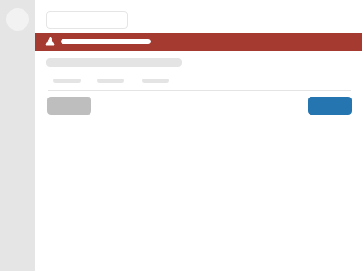

import Tabs from '@theme/Tabs';
import TabItem from '@theme/TabItem';

Error messages are a critical user interface component, they must explain to people that something unexpected has occurred and how to resolve it.

## General guidance

The choice of language used in an error message should be seen as a design task as important as anything else, the choice of wording is crucial if the user has any chance of resolving an error condition.

Error messages should:

* Be visually distinct, obvious and easy to spot
* Be placed close to the source of the problem
* Use plain language
* Be brief

Error messages should not:

* be vague, such as saying ‘a problem occurred’
* Use technical language, like ‘transcoding failed’
* say ‘sorry’, because it does not help fix the problem
* attempt to use humour, like saying 'oops, something went wrong’

## General errors

### Page title

The `<title>` attribute of the page should be prepended with the word Error, as well as acting as a visual indicator that the tab contains an error, it is also the first word that a screen reader will announce when the page has loaded, informing screen reader users that something has gone wrong.

The title attribute can be set on page load in the title block, you'll need to add the related logic to update this based on a form validation failure.

```twig

    Error - Jadu Control Center - Create Document

```

## Flash message

Flash messages are displayed at the top of the user interface and will often be the first indication that a page contains an error. A flash message should not be the only method used to communicate an error.



Refer to the flash message documentation to learn how to create flash messages.

## Form errors

When a form contains errors, you should:

* Add 'Error:' to the beginning of the page title, so screen readers read it out as soon as possible
* Show an error summary at the top of the form
* Move keyboard focus to the error summary
* Use the heading, 'There is a problem' within the error summary
* Show the same error messages under the inputs as is used in the error summary
* Link error summary errors to the respective inputs
* Ensure error messages are descriptive, clearly worded and inform the user how to correct the issue
* Mark fields with errors as invalid

## Error summary

When a form contains errors, you must show both the error summary at the top of the form and an error message below each input that contains an error. The error summary should be shown when there are form errors, even if there is only one.


<div className="d-example">
<form method="POST" encType="application/x-www-form-urlencoded" className="form">
<section aria-labelledby="error-summary-title" data-error-summary="true" tabIndex="-1" className="error-summary">
<h2 className="error-summary__title" id="error-summary-title">There is a problem</h2>
<ul className="error-summary__list">
<li className="error-summary__list-item">
<a className="error-summary__list-link" href="#first-name">Enter your first name</a>
</li>
<li className="error-summary__list-item">
<a className="error-summary__list-link" href="#last-name">Enter your last name</a>
</li>
</ul>
</section>

<fieldset>
<legend className="legend">Example form with errors</legend>

<div className="form__group form__group--full has-error">
<label htmlFor="first-name" className="control__label">First name&nbsp;<span className="required-indicator" data-toggle="tooltips" title="" data-original-title="required">*</span></label>
<div className="controls">
<input id="first-name" required="" aria-required="true" type="text" aria-describedby="guid-12478230" aria-invalid="true" className="form__control" /><span className="help-block is-error" id="guid-12478230"><i aria-hidden="true" className="icon-warning-sign"></i> Enter your first name</span>
</div>
</div>

<div className="form__group form__group--full has-error">
<label htmlFor="last-name" className="control__label">Last name&nbsp;<span className="required-indicator" data-toggle="tooltips" title="" data-original-title="required">*</span></label>
<div className="controls">
<input id="last-name" required="" aria-required="true" type="text" aria-describedby="guid-482694121" aria-invalid="true" className="form__control" /><span className="help-block is-error" id="guid-482694121"><i aria-hidden="true" className="icon-warning-sign"></i> Enter your last name</span>
</div>
</div>
</fieldset>

<div className="form__actions">
<button className="btn btn--primary">Save</button>
<button className="btn btn--naked">Cancel</button>
</div>
</form>
</div>

Refer to the [error summary documentation](forms/error-summary.mdx) to learn how to create error summaries.

:::tip
By using the error-summary helper, errors will be automatically linked to the inputs and keyboard focus will be moved to the summary on page load
:::

### Linking from the error summary to each input

Each error in the error summary must link to the input it relates to. When an error relates to a single input, it should link to that input.

When an error relates to multiple fields, such as day, month, year inputs which make up a date of birth, then link to the first input with an error. If you do not know which input contains an error, link to the first input in the group that has an error.

For inputs that require a user to select one or more options from a list using radios or checkboxes, link to the first radio or checkbox.

### Where to put the error summary

Put the error summary at the top of the `form`, typically above the first `fieldset`.

### Invalid fields

Form fields should be individually given descriptive error text which explains in clear, concise language, what the person filling in this form needs to do to resolve the error for this specific field.

If the person is expected to provide information in a specific format, such as an email address, date or postcode, an example should be provided either through help text, or as part of the error message.

Each form helper will allow the error message to be defined by the error helper option. If you're using HTML you will have to refer to each form component's documentation for the correct combination of markup and classes to use.

Avoid messages like:

* ‘Field cannot be empty’
* ‘This field is required’
* ’Invalid value’
* ’Answer the question’

<div className="d-example">
  <div className="form__group form__group--full has-error">
    <label htmlFor="firstName" className="control__label">First name</label>
    <div className="controls">
      <input id="firstName" name="firstName" type="text" aria-describedby="guid-946527265" aria-invalid="true" className="form__control" /><span className="help-block is-error" id="guid-946527265"><i aria-hidden="true" className="icon-warning-sign"></i> Enter your first name</span>
    </div>
  </div>

  <div className="form__group form__group--full has-error">
    <label htmlFor="email" className="control__label">Email address</label>
    <div className="controls">
      <input id="email" name="email" value="my-email at hotmail dot com" type="text" aria-describedby="guid-1644572689" aria-invalid="true" className="form__control" /><span className="help-block is-error" id="guid-1644572689"><i aria-hidden="true" className="icon-warning-sign"></i> Enter an email address in the correct format, like name@example.com</span>
    </div>
  </div>
</div>

### Accessibility considerations

Pulsar twig helpers automatically include the required accessibility features and should be used as much as possible, if you have to use plain HTML then your implementation must include the same accessibility features. Failure to do this will result in a user interface that may fail an accessibility audit and not provide a sufficient experience for the people using our software.

If you are dynamically toggling the state of an input between valid and invalid without a page refresh, you must ensure you’re toggling the relevant combination of classes and aria attributes where applicable.

### Colour

When a form field is in error state, the label, the field border, and the error message should all use the danger colour. The shade of red used in the danger colour contrast is WCAG 2.1 AA compliant. If you're using the correct combination of markup and error classes as described by the component documentation this should be styled automatically, however if you need to style somthing custom then you can fetch the danger colour from the palette.

```scss
.example {
    color: colour(danger);
}
```

### Visual indicator

All form field errors should be visually marked with the warning icon so that colour is not the only method of differentiating between an error and regular help text.

For regular form layouts, the error message should be placed immediately underneath the related input. If additional help text is required this should be placed underneath the error message.


<Tabs
  groupID="example"
  defaultValue="twig"
  values={[
    { label: 'Twig', value: 'twig', },
    { label: 'React', value: 'react', },
    { label: 'HTML', value: 'html', },
  ]
}>
<TabItem value="twig">

```twig
{{
    form.text({
        'label': 'Email address',
        'id': 'email', 
        'name': 'email',
        'value': 'my-email at hotmail dot com',
        'error': 'Enter an email address in the correct format',
        'help': 'e.g. name@example.com'
    })
}}
```

</TabItem>
<TabItem value="react">

```jsx
<FormGroup 
  labelText="Email address" 
  helpText="e.g. name@example.com"
  error="Enter an email address in the correct format">
  <TextInput 
    name="email"
    value="my-email at hotmail dot com" />
</FormGroup>
```

</TabItem>
<TabItem value="html">

```html
<div class="form__group has-error">
  <label for="email"  class="control__label">Email address</label>
  <div class="controls">
    <input id="email" name="email" value="my-email at hotmail dot com" type="text" aria-describedby="guid-1230479011 guid-1978442325" aria-invalid="true"  class="form__control" />
    <span class="help-block is-error" id="guid-1978442325"><i aria-hidden="true"  class="icon-warning-sign"></i> Enter an email address in the correct format</span>
    <span class="help-block" id="guid-1230479011">e.g. name@example.com</span>
  </div>
</div>
```

</TabItem>
</Tabs>

### Aria-invalid

Invalid fields should have the `aria-invalid="true"` attribute applied, this allows assistive technologies to correctly interpret and announce the state of an invalid field.

:::caution
If you’re not using Twig or React helpers in your UI and are choosing to use plain HTML, it’s your responsibility to use an appropriate label matched to the input with `aria-describedby`
:::