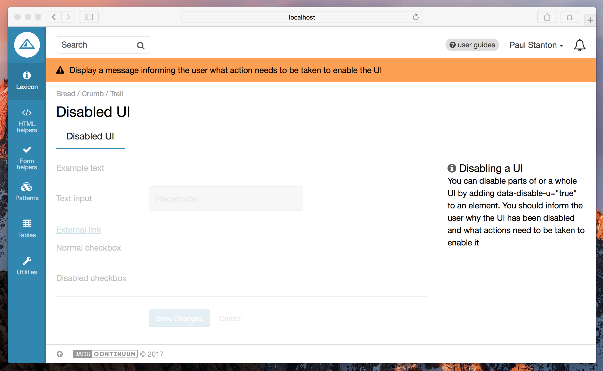

import Tabs from '@theme/Tabs';
import TabItem from '@theme/TabItem';

The Disabled UI pattern allows you to prevent the user from interacting with parts of a UI. This can be useful when an external action needs completing before the UI can be used. A message should be shown advising the user what action needs to be taken.



## Dependencies

You will need the `DisableUiComponent` to be included in your browserify configuration.

Depending on your setup, this will probably need to be in be in a file called `index.js` or `main.js`.

```js title="index.js"
var DisableUiComponent = require('/path/to/pulsar/DisableUiComponent');

module.exports = {
  DisableUiComponent: DisableUiComponent
}
```

```js main.js
var $html = $('html');

pulsar.disableUi = new pulsar.DisableUiComponent($html);

$(function () {
  pulsar.disableUi.init();
});
```

## Basic usage

Add `data-disable-ui="true"` to the element you wish to disable. All child elements will also be disabled.

:::info
It is expected that you will write your own code to enable this UI when the correct conditions are met, if you want to disable the UI and present a single 'enable' control to the user, check out the Masterswitch pattern instead.
:::

<Tabs
  groupID="example"
  defaultValue="twig"
  values={[
    { label: 'Twig', value: 'twig', }
  ]
}>
<TabItem value="twig">

```twig
<p>This is outside the containing div and will not be disabled</p>
<div data-disable-ui="true">
  {{ form.create() }}
    {{ form.fieldset_start({'legend': 'Filter by'}) }}

    {{
      form.text({
        'label': 'Text field example',
        'id': 'foo'
      })
    }}

  {{ form.fieldset_end() }}
  {{
    form.end({
      'actions': [
        form.submit({
          'label': 'Save',
          'class': 'btn--primary'
        }),
        html.link({
          'label': 'Cancel',
          'class': 'btn--naked',
        })
      ]
    })
  }}
</div>
```

</TabItem>
</Tabs>