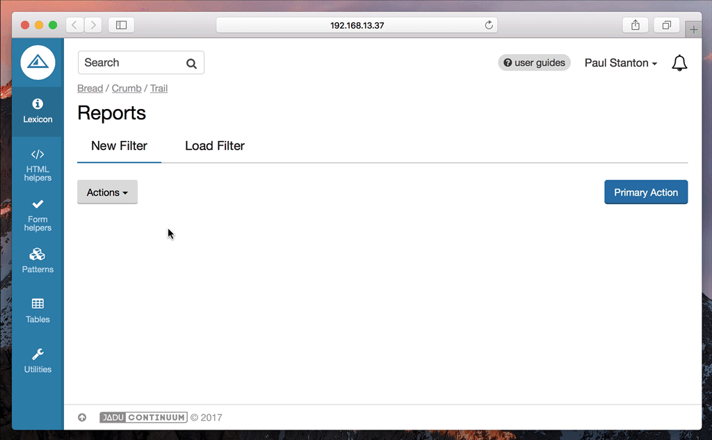

import Tabs from '@theme/Tabs';
import TabItem from '@theme/TabItem';

The filter bar pattern allows you to build up a list of filters to be applied to a UI. Commonly used to filter tabular data as an alternative to displaying a potentially large form.



## Dependencies

You will need the `FilterBarComponent` to be included in your browserify configuration.

Depending on your setup, this will probably need to be in be in a file called `index.js` or `main.js`.

```js title="index.js"
var FilterBarComponent = require('/path/to/pulsar/FilterBarComponent');

module.exports = {
  FilterBarComponent: FilterBarComponent
}
```

```js main.js
var $html = $('html');

pulsar.filterBar = new pulsar.FilterBarComponent($html);

$(function () {
  pulsar.filterBar.init();
});
```

## Basic usage

At it’s core, the filterbar is a regular hidden form which is processed by the FilterBarComponent to turn it into the interactive filter bar. This hidden form should be wrapped with a containing `<div class="filter-bar display--none">`.

To trigger the opening of the filter bar, you should add a 'new filter' item to the actions dropdown menu.

:::warning
There should only be one filter bar within a given UI, although there could be multiple filter bars on different tabs.
:::

<Tabs
  groupID="example"
  defaultValue="twig"
  values={[
    { label: 'Twig', value: 'twig', }
  ]
}>
<TabItem value="twig">

```twig
<section class="actionsbar" aria-label="page actions">
  <div class="float--left">
    {{
      html.actions_menu({
        'items': [
          [
            {
              'label': 'New Filter',
              'href': '#',
              'icon': 'filter',
              'data-ui': 'show-filter-bar'
            }
          ]
        ]
      })
    }}
  </div>
</section>

<div class="filter-bar display--none">
  {{ form.create() }}
    {{ form.fieldset_start({'legend': 'Filter by'}) }}

    {{
      form.select2({
        'label': 'Colour',
        'id': 'colour',
        'multiple': true,
        'placeholder': 'Choose one or more',
        'options': {
          'colour_red': 'Red',
          'colour_blue': 'Blue'
        }
      })
    }}

    {{
      form.select2({
        'label': 'Size',
        'id': 'size',
        'placeholder': 'Choose one',
        'options': {
          'small': 'Small',
          'medium': 'Medium',
          'large': 'Large'
        }
      })
    }}

    {{
      form.text({
        'label': 'Text field example',
        'id': 'foo'
      })
    }}

    {{
      form.date({
        'label': 'Added from',
        'id': 'addedFrom',
      })
    }}

    {{
      form.date({
        'label': 'Added to',
        'id': 'addedTo'
      })
    }}

    {{
      form.checkbox({
        'label': 'In stock',
        'id': 'inStock'
      })
    }}

  {{ form.fieldset_end() }}
  {{
    form.end({
      'actions': [
        form.submit({
          'label': 'Save',
          'class': 'btn--primary'
        }),
        html.link({
          'label': 'Clear',
          'class': 'btn btn--naked',
          'href': '#',
          'data-ui': 'clear-all-filters'
        })
      ]
    })
  }}

</div>
```

</TabItem>
</Tabs>

## Setting initial state

There may be situations where you need to pre-populate and display the filter bar on page load. The filter bar will automatically do that if the filter form fields have values or selected options.

It’s worth noting that any select elements in the filter form will need to have an empty first option to prevent the filter bar taking the first option as a selected option. This also applies when using the select2 helper, see the example below:

```twig
{{
  form.select2({
    'label': 'Size',
    'id': 'size',
    'placeholder': 'Choose one',
    'options': {
      '': '',
      'small': 'Small',
      'medium': 'Medium',
      'large': 'Large'
    }
  })
}}
```