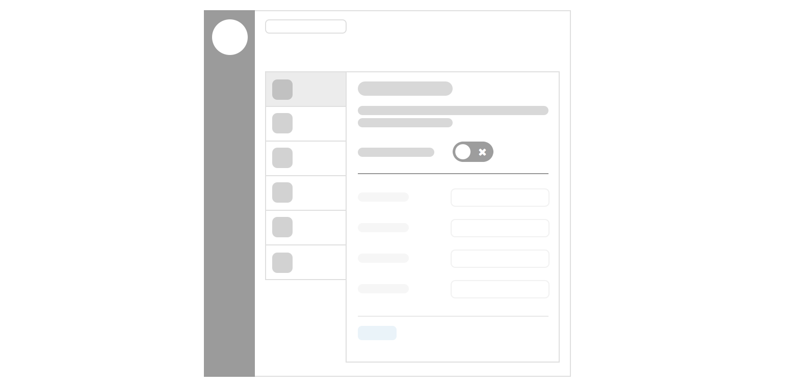
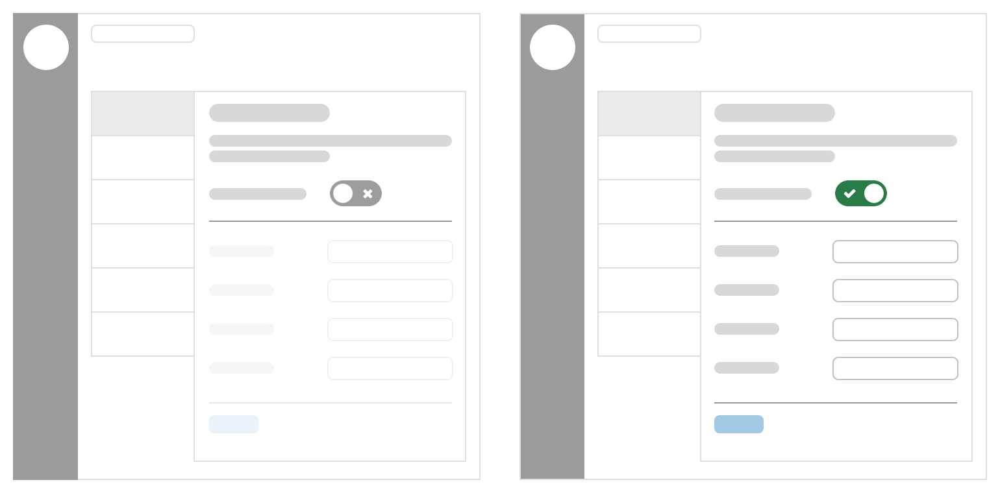
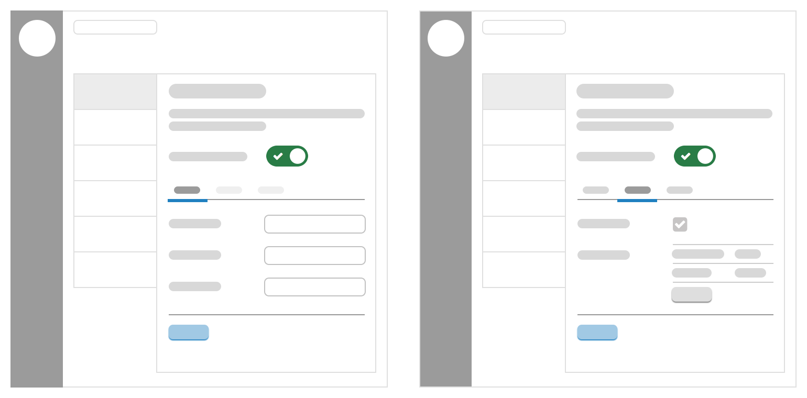

import Tabs from '@theme/Tabs';
import TabItem from '@theme/TabItem';

Integrations are a highly technical feature, often linking together separate systems and software using technical terminology like port numbers, timeouts and access tokens. Great care should be taken to design the integration to help the user understand what information they must supply and where they can find it.

## Integrations hub

The integrations hub lists all of the currently available integrations available within a given Continuum product using a Pulsar 'piano' layout, listing the integrations as tabs on the left and their configurations on the right.



## Integrations tab

The tabs content is marked up as a standard media object, using Pulsar’s `html.media()` object.

<div className="d-example">
  <div className="media">
    
    <div className="media__body">
      <p>Office 365</p>
      <span className="small-type">Access Outlook calendars within your CMS</span>
    </div>
  </div>
</div>

```twig
{{
  html.media({
    'image': '/views/patterns/integrations/img/office365.png',
    'image_alt': 'Office365 logo',
    'title': 'Office 365',
    'description': 'Access Outlook calendars within your CMS'
  })
}}
```

### Tab icon

Allows an integration to be branded to make them more recognisable, you should use authorised brand assets where possible, taking care not to break any brand guidelines.

* Images should be 100 x 100px square (will be displayed at 50px square)
* Should have a transparent background
* Should be added to the repository, don’t link to externally hosted assets

:::tip
Most of the time it will be necessary for us to create a new icon based on a product's brand assets, you should aim to find the most appropriate branding which would suit the square nature of the tab icon, avoid small wordmarks which would be unreadable at 50px, and aim to use as much of the available space as possible without extra padding.

The Pulsar team will be more than happy to assist in creating tab icons.
:::

Instead of an image you could use a FontAwesome icon to illustrate the tab and define a specific colour value to match a company's brand, see the [branding icons category](https://fontawesome.com/icons?from=io#brand).

## Tab title

The title should, ideally, be the name of the software being integrated.

* PayPal
* YouTube
* Office365

If a company name isn't widely known, or provides multiple services, you should make the title more descriptive as to the nature of the integration.

* Google Analytics
* Google Drive
* Google Maps
* ESRI Maps

Some integrations won't relate to a specific company or software and should try and use the most obvious descriptive name.

* LDAP Authentication
* Website Analytics

<div className="d-guidelines">
  <div className="d-guidelines__block d-guidelines__block--do">
  <div className="d-guidelines-preview">
    <div className="media">
      <i aria-hidden="true" className="icon-youtube-square media__image" style={{ color: "#E52D27" }}></i>
      <div className="media__body">
        <p>YouTube</p>
        <span className="small-type">Upload video to YouTube</span>
      </div>
    </div>
  </div>
  <div className="d-guidelines-label"><em className="d-guidelines-label__title">Do</em> use title case, unless branding guidelines doctate otherwise (like YouTube)</div>
  </div>
  
  <div className="d-guidelines__block d-guidelines__block--not">
    <div className="d-guidelines-preview">
      <div className="media">
      <i aria-hidden="true" className="icon-youtube-square media__image" style={{ color: "#E52D27" }}></i>
      <div className="media__body">
        <p>YouTube.</p>
        <span className="small-type">Upload video to YouTube.</span>
      </div>
    </div>
    </div>
    <div className="d-guidelines-label"><em className="d-guidelines-label__title">Don’t</em> use a trailing full stop</div></div>
</div>

## Tab description

The description is a single line to provide extra information about what the integration does and can be used to clarify ambiguous titles. Try to describe the integration in 10 words or fewer, the tab container has limited width and shouldn't break onto multiple lines.

<div className="d-guidelines">
  <div className="d-guidelines__block d-guidelines__block--do">
    <div className="d-guidelines-preview">
      <div className="media">
      
      <div className="media__body">
        <p>Office 365</p>
        <span className="small-type">Access Outlook calendars within your CMS</span>
      </div>
    </div>
  </div>
  <div className="d-guidelines-label"><em className="d-guidelines-label__title">Do</em> explain what the integration will enable the users to do</div>
  </div>
  
  <div className="d-guidelines__block d-guidelines__block--not">
    <div className="d-guidelines-preview">
      <div className="media">
        
        <div className="media__body">
          <p>Office 365</p>
          <span className="small-type">Enable Office365 integration</span>
        </div>
      </div>
    </div>
    <div className="d-guidelines-label"><em className="d-guidelines-label__title">Don’t</em> simply explain what the integration process is</div>
  </div>
</div>

A properly formed tab description should be able to complete the following sentence:

> When enabled, this integration will allow you to [...]

## Main integration user interface

An integration should use the 'masterswitch' layout pattern where possible, this provides a clear 'on/off' switch for an Administrator to enable or disable an integration in one easy step, and helps the person to understand whether an integration is currently active or not.



A brief description (one or two short paragraphs) should be put at the top of the settings view (above the masterswitch) to further explain this integration or to provide important information which may be needed to successfully set it up.

e.g. Inform the user how to find specific details on the external system they're integrating with.

> You will find these details by signing into your Continuum CXM and navigating to Settings > System > Service APIs.
>
> Permission to add service APIs will be required.

or

> Add the tracking code from any analytics program like Google Analytics, Piwik, KISSMetrics, etc and it will be included in the footer of all pages on your public website.

## Masterswitch control

The masterswitch pattern allows an entire UI to be disabled while the switch is in the 'off' position.

Disabling an integration should happen immediately and not require an extra 'save' or confirmation step, however after enabling the switch, the integration should not be activated until they have completed all required fields to configure the integration.

If disabling an integration is a potentially destructive action, you should use a confirmation modal to illustrate the impact of the action to the user.


<div className="d-guidelines">
  <div className="d-guidelines__block d-guidelines__block--do">
    <div className="d-guidelines-preview">
      <div className="form__group form__group--full  form__group--toggle">
        <label className="toggle-switch-wrapper-label" htmlFor="guid-1181820001">
          <span className="control__label">Enable integration</span>
          <span className="controls">
            <input id="guid-1181820001" name="toggle1" type="checkbox" className="form__control toggle-switch" />
            <span className="toggle-switch-label"></span>
          </span>
        </label>
      </div>
      <div className="form__group form__group--full form__group--toggle">
        <label className="toggle-switch-wrapper-label" htmlFor="guid-1181820002">
          <span className="control__label">Enable integration</span>
          <span className="controls">
            <input id="guid-1181820002" name="toggle2" type="checkbox" className="form__control toggle-switch" checked="checked" />
            <span className="toggle-switch-label"></span>
          </span>
        </label>
      </div>
    </div>
    <div className="d-guidelines-label"><em className="d-guidelines-label__title">Do</em> keep the label consistent to indicate state</div>
  </div>
  
  <div className="d-guidelines__block d-guidelines__block--not">
    <div className="d-guidelines-preview">
      <div className="form__group form__group--full form__group--toggle">
        <label className="toggle-switch-wrapper-label" htmlFor="guid-1181820003">
          <span className="control__label">Enable integration</span>
          <span className="controls">
            <input id="guid-1181820003" name="toggle3" type="checkbox" className="form__control toggle-switch" />
            <span className="toggle-switch-label"></span>
          </span>
        </label>
      </div>
      <div className="form__group form__group--full form__group--toggle">
        <label className="toggle-switch-wrapper-label" htmlFor="guid-1181820004">
          <span className="control__label">Disable integration</span>
          <span className="controls">
            <input id="guid-1181820004" name="toggle4" type="checkbox" className="form__control toggle-switch" checked="checked" />
            <span className="toggle-switch-label"></span>
          </span>
        </label>
      </div>
    </div>
    <div className="d-guidelines-label"><em className="d-guidelines-label__title">Don’t</em> change the label to indicate the action that will be performed</div>
  </div>
</div>

<div className="d-guidelines">
  <div className="d-guidelines__block d-guidelines__block--do">
    
    <div className="d-guidelines-preview">
      <div className="form__group form__group--full  form__group--toggle">
        <label className="toggle-switch-wrapper-label" htmlFor="guid-1181820005">
          <span className="control__label">Enable integration</span>
          <span className="controls">
            <input id="guid-1181820005" name="toggle1" type="checkbox" className="form__control toggle-switch" />
            <span className="toggle-switch-label"></span>
          </span>
        </label>
      </div>
    </div>
    <div className="d-guidelines-label"><em className="d-guidelines-label__title">Do</em> use the label 'Enable Integration'</div>
  </div>
  <div className="d-guidelines__block d-guidelines__block--not">
    <div className="d-guidelines-preview">
      <div className="form__group form__group--full form__group--toggle">
        <label className="toggle-switch-wrapper-label" htmlFor="guid-1181820006">
          <span className="control__label">Enable Google Drive</span>
          <span className="controls">
            <input id="guid-1181820006" name="toggle3" type="checkbox" className="form__control toggle-switch" />
            <span className="toggle-switch-label"></span>
          </span>
        </label>
      </div>
    </div>
    <div className="d-guidelines-label"><em className="d-guidelines-label__title">Don’t</em> use product/service names</div>
  </div>
</div>

## Form fields

Because integrations are often highly technical in nature, you should use every opportunity to use help text to provide more context around a field.

<div className="d-guidelines">
  <div className="d-guidelines__block d-guidelines__block--do">
    <div className="d-guidelines-preview">
      <div className="form__group">
        <label htmlFor="guid-1916610908" className="control__label">Timeout</label>
        <div className="controls">
          <div className="input-group">
            <input id="guid-1916610908" aria-describedby="guid-help-1916610908" type="text" className="form__control" defaultValue="600" />
            <span className="input-group-addon">Seconds</span>
          </div>
          <span className="help-block" id="guid-help-1916610908">How long the system should wait for a response, usually 600 seconds (10 minutes)</span>
        </div>
      </div>
    </div>
    <div className="d-guidelines-label"><em className="d-guidelines-label__title">Do</em> use units of measure, and explain what the setting actually means</div>
  </div>
  
  <div className="d-guidelines__block d-guidelines__block--not">
    <div className="d-guidelines-preview">
      <div className="form__group">
        <label htmlFor="guid-1916610909" className="control__label">Timeout</label>
        <div className="controls">
          <input id="guid-1916610909" aria-describedby="guid-help-1916610909" type="text" className="form__control" />
        </div>
      </div>
    </div>
    <div className="d-guidelines-label"><em className="d-guidelines-label__title">Don’t</em> expect people to know what any of this means</div>
  </div>
</div>

Be clear about what system a setting relates to, for example, if you're asking for a username, is that the person’s username on System A, or System B?

<div className="d-guidelines">
  <div className="d-guidelines__block d-guidelines__block--do">
    <div className="d-guidelines-preview">
      <div className="form__group">
        <label htmlFor="guid-10" className="control__label">GitHub access token</label>
        <div className="controls">
          <div className="input-group">
            <input id="guid-10" aria-describedby="guid-help-10" type="text" className="form__control" />
          </div>
          <span className="help-block" id="guid-help-10">Find your personal token at <a href="https://github.com/settings/tokens">https://github.com/settings/tokens</a></span>
        </div>
      </div>
    </div>
    <div className="d-guidelines-label"><em className="d-guidelines-label__title">Do</em> be clear about which system/software a value originates from, and where to find it</div>
  </div>
  
  <div className="d-guidelines__block d-guidelines__block--not">
    <div className="d-guidelines-preview">
      <div className="form__group">
        <label htmlFor="guid-11" className="control__label">Access token</label>
        <div className="controls">
          <input id="guid-11" aria-describedby="guid-help-11" type="text" className="form__control" />
        </div>
      </div>
    </div>
    <div className="d-guidelines-label"><em className="d-guidelines-label__title">Don’t</em> be ambiguous</div>
  </div>
</div>

Quite often you may need to allow an admin to configure server oriented variables, such as port numbers, timeouts and proxy addresses. You should provide sensible defaults for these where possible, giving the admin a higher likelihood of getting it right 'first time'. Choose your field type wisely, for example, if an integration only has a specific list of valid port numbers available, use a `form.choice()` helper instead of a free text input, reducing the opportunity for accidental errors.

If the admin needs to ask their sysadmin/network administrator for specific values, or to get ports unblocked, then it's useful to let them know upfront.

## Tabbed integrations

For more complex integrations it may make sense to split the settings over multiple tabs.



The first tab should be active when the user enables the masterswitch, however you may need/want to disable the other tabs until some required information has been completed.

Use cases for this may include:

* User connects to the integrating system on the first tab
* Integration can now fetch data from the integrated system to allow further configuration on other tabs